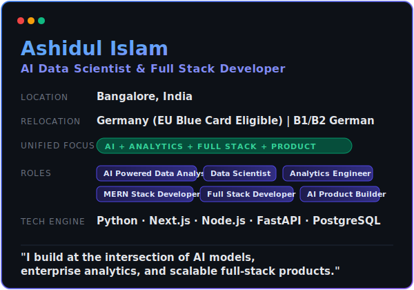

<!-- ════════════════════════════════════════════════════════════════════ -->
<!--                             HEADER BANNER                          -->
<!-- ════════════════════════════════════════════════════════════════════ -->

<!-- ════════════════════════════════════════════════════════════════════ -->
<!--                        TYPING ANIMATION                            -->
<!-- ════════════════════════════════════════════════════════════════════ -->

 

<!-- TAGLINE -->

  

<!-- ════════════════════════════════════════════════════════════════════ -->
<!--                         QUICK ACTION BUTTONS                       -->
<!-- ════════════════════════════════════════════════════════════════════ -->

  
  &nbsp;
  
  &nbsp;
  
  &nbsp;
  
  &nbsp;
  
  &nbsp;
  
  &nbsp;
  

<!-- ════════════════════════════════════════════════════════════════════ -->
<!--                            ABOUT ME & STATS                        -->
<!-- ════════════════════════════════════════════════════════════════════ -->

### ⚡ Professional Blueprint

<!-- ════════════════════════════════════════════════════════════════════ -->
<!--                       CURRENTLY WORKING ON                         -->
<!-- ════════════════════════════════════════════════════════════════════ -->

### 🔭 Current Focus & Execution Map

<table width="100%">
  <thead>
    <tr bgcolor="#161b22">
      <th width="20%" align="center"><b>Vector</b></th>
      <th width="25%" align="left"><b>Focus Area</b></th>
      <th width="40%" align="left"><b>Technology &amp; Goal</b></th>
      <th width="15%" align="center"><b>Timeline</b></th>
    </tr>
  </thead>
  <tbody>
    <tr>
      <td align="center">
        
      </td>
      <td><b>AI Product Engineering</b></td>
      <td>LLM fine-tuning, RAG frameworks (LangChain), and agentic workflows</td>
      <td align="center"><code>Ongoing</code></td>
    </tr>
    <tr>
      <td align="center">
        
      </td>
      <td><b>Analytics Engineering</b></td>
      <td>Modern Data Stack integration, data pipelines (FastAPI, dbt)</td>
      <td align="center"><code>Q3 2026</code></td>
    </tr>
    <tr>
      <td align="center">
        
      </td>
      <td><b>MERN Stack Upgrades</b></td>
      <td>Next.js App Router optimization, TypeScript backend refactoring</td>
      <td align="center"><code>Q3 2026</code></td>
    </tr>
    <tr>
      <td align="center">
        
      </td>
      <td><b>Germany Relocation Prep</b></td>
      <td>Intensive B2 German language training (Goethe-Institut curriculum)</td>
      <td align="center"><code>Late 2026</code></td>
    </tr>
  </tbody>
</table>

<!-- ════════════════════════════════════════════════════════════════════ -->
<!--                            TECH STACK                              -->
<!-- ════════════════════════════════════════════════════════════════════ -->

## 🛠 Tech Stack & Ecosystem

  

<table width="100%">
  <thead>
    <tr bgcolor="#161b22">
      <th width="28%" align="center"><b>Layer</b></th>
      <th width="72%" align="left"><b>Technologies &amp; Ecosystem</b></th>
    </tr>
  </thead>
  <tbody>
    <tr>
      <td align="center"><b>💻 MERN &amp; Full Stack</b></td>
      <td>
        &nbsp;
        &nbsp;
        &nbsp;
        &nbsp;
        &nbsp;
        &nbsp;
        &nbsp;
        &nbsp;
        
      </td>
    </tr>
    <tr>
      <td align="center"><b>🧠 AI &amp; Data Science</b></td>
      <td>
        &nbsp;
        &nbsp;
        &nbsp;
        &nbsp;
        &nbsp;
        &nbsp;
        &nbsp;
        &nbsp;
        &nbsp;
        
      </td>
    </tr>
    <tr>
      <td align="center"><b>🗄️ Database &amp; Storage</b></td>
      <td>
        &nbsp;
        &nbsp;
        
      </td>
    </tr>
    <tr>
      <td align="center"><b>🔧 DevOps &amp; Cloud</b></td>
      <td>
        &nbsp;
        &nbsp;
        &nbsp;
        &nbsp;
        &nbsp;
        
      </td>
    </tr>
  </tbody>
</table>

<!-- ════════════════════════════════════════════════════════════════════ -->
<!--                     🏆 TROPHIES & ACHIEVEMENTS                     -->
<!-- ════════════════════════════════════════════════════════════════════ -->

## 🏆 Trophies & Achievements

 

  

### 🎖️ Earned Badges

<!-- ════════════════════════════════════════════════════════════════════ -->
<!--                         GITHUB STATS                               -->
<!-- ════════════════════════════════════════════════════════════════════ -->

## 📊 GitHub Analytics

 

&nbsp;&nbsp;

  

  

<!-- ════════════════════════════════════════════════════════════════════ -->
<!--                        LEETCODE STATS                              -->
<!-- ════════════════════════════════════════════════════════════════════ -->

## 🏅 LeetCode Stats

 

<!-- ════════════════════════════════════════════════════════════════════ -->
<!--                        ACTIVITY GRAPH                              -->
<!-- ════════════════════════════════════════════════════════════════════ -->

## 📈 Activity Graph

 

<!-- ════════════════════════════════════════════════════════════════════ -->
<!--                    3D CONTRIBUTION CALENDAR                        -->
<!-- ════════════════════════════════════════════════════════════════════ -->

## 🧊 3D Contribution Calendar

 

<!-- ════════════════════════════════════════════════════════════════════ -->
<!--                      CONTRIBUTION SNAKE                            -->
<!-- ════════════════════════════════════════════════════════════════════ -->

## 🐍 Contribution Snake

 

<picture>
  <source media="(prefers-color-scheme: dark)" srcset="https://raw.githubusercontent.com/Ashid332/Ashid332/output/github-contribution-grid-snake-dark.svg" />
  <source media="(prefers-color-scheme: light)" srcset="https://raw.githubusercontent.com/Ashid332/Ashid332/output/github-contribution-grid-snake.svg" />
  
</picture>

<!-- ════════════════════════════════════════════════════════════════════ -->
<!--                         WHAT I ENJOY BUILDING                      -->
<!-- ════════════════════════════════════════════════════════════════════ -->

## 💡 What I Enjoy Building

I enjoy creating applications where AI, analytics, and full stack engineering intersect.

Most of my work focuses on:
- turning raw data into interactive insights,
- building scalable backend systems,
- integrating AI into real-world workflows,
- and designing clean user-focused products.

<!-- ════════════════════════════════════════════════════════════════════ -->
<!--                           LET'S CONNECT                            -->
<!-- ════════════════════════════════════════════════════════════════════ -->

## 📫 Let's Connect

I'm currently open to:
- 💼 **Target Roles**: AI & Data Analytics, MERN / Full Stack Engineering, Analytics Engineering
- 📍 **Work Preferences**: Bangalore, India (On-site/Hybrid) | Remote (CET/Global-compatible)
- ✈️ **EU Relocation**: Ready to relocate (EU Blue Card eligible, active B1/B2 German prep)
- 🚀 **Opportunities**: Full-time roles, remote internships, freelance contracts, and startup teams

  

  

  

  

  

<!-- ════════════════════════════════════════════════════════════════════ -->
<!--                         FOOTER BANNER                              -->
<!-- ════════════════════════════════════════════════════════════════════ -->

