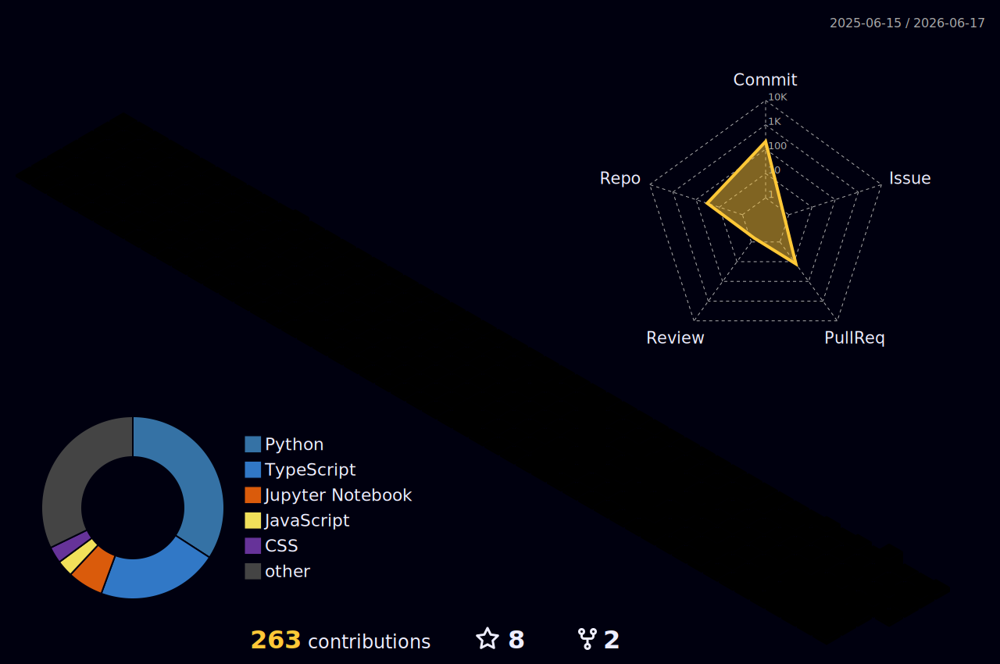

<div align="center">

<!-- ════════════════════════════════════════════════════════════════════ -->
<!--                       ANIMATED HEADER BANNER                       -->
<!-- ════════════════════════════════════════════════════════════════════ -->


<!-- ════════════════════════════════════════════════════════════════════ -->
<!--                        TYPING ANIMATION                            -->
<!-- ════════════════════════════════════════════════════════════════════ -->

<a href="https://git.io/typing-svg">
  
</a>

<br>

<!-- TAGLINE -->


<br><br>

<!-- ════════════════════════════════════════════════════════════════════ -->
<!--                         QUICK ACTION BUTTONS                       -->
<!-- ════════════════════════════════════════════════════════════════════ -->

<div align="center">
  <a href="mailto:ashiduli53@gmail.com"></a>
  &nbsp;
  <a href="https://linkedin.com/in/ashidulislam"></a>
  &nbsp;
  <a href="https://wa.me/918258011806"></a>
  &nbsp;
  <a href="https://leetcode.com/u/ashid332/"></a>
  &nbsp;
  
</div>

</div>


<!-- ════════════════════════════════════════════════════════════════════ -->
<!--                            ABOUT ME & STATS                        -->
<!-- ════════════════════════════════════════════════════════════════════ -->

<table>
<tr>
<td width="55%" valign="top">

### ⚡ Professional Blueprint

```javascript
const developer = {
  name: "Ashidul Islam",
  coreIdentity: "AI Data Analyst & Full Stack Developer",
  location: "Bangalore, India",
  philosophy: "Building enterprise-grade AI analytics and scalable products that turn raw datasets into strategic business revenue.",
  relocationTarget: {
    ready: true,
    preferredLocations: [
      "Bangalore (On-site/Hybrid)", 
      "Germany (EU Blue Card Eligible)", 
      "Remote Global"
    ],
    germanLanguageLevel: "B1/B2 in progress"
  },
  domainExpertise: [
    "AI Product Engineering", 
    "Predictive Modeling & ML", 
    "Enterprise Analytics & ETL", 
    "MERN Full-Stack Development", 
    "Analytics Engineering"
  ]
};
```

</td>
<td width="45%" valign="top">

### 📊 GitHub Activity Snapshot

<div align="center">


<br>


</div>

</td>
</tr>
</table>


<!-- ════════════════════════════════════════════════════════════════════ -->
<!--                       CURRENTLY WORKING ON                         -->
<!-- ════════════════════════════════════════════════════════════════════ -->

<div align="center">

### 🔭 Current Focus & Execution Map

| Vector | Focus Area | Technology / Goal | Target Timeline |
| :---: | :--- | :--- | :---: |
| 🤖 | **AI Product Engineering** | LLM fine-tuning, RAG frameworks (LangChain), and agentic workflows | Ongoing |
| 📊 | **Analytics Engineering** | Modern Data Stack integration, data pipelines (FastAPI, dbt) | Q3 2026 |
| 💻 | **MERN Stack Upgrades** | Next.js App Router optimization, TypeScript backend refactoring | Q3 2026 |
| 🇩🇪 | **Germany Relocation Prep** | Intensive B2 German language training (Goethe-Institut curriculum) | Late 2026 |

</div>


<!-- ════════════════════════════════════════════════════════════════════ -->
<!--                            TECH STACK                              -->
<!-- ════════════════════════════════════════════════════════════════════ -->

## 🛠 Tech Stack & Ecosystem

<div align="center">
  <a href="https://skillicons.dev">
    
  </a>
</div>

<br>

<details open>
<summary><b>💻 Full Stack & MERN Development</b></summary>
<br>

<p>
  
  
  
  
  
  
  
  
  
</p>
</details>

<details open>
<summary><b>🧠 Data Science, Analytics & AI Engineering</b></summary>
<br>

<p>
  
  
  
  
  
  
  
  
  
  
</p>
</details>

<details open>
<summary><b>🗄️ Database & Storage</b></summary>
<br>

<p>
  
  
  
</p>
</details>

<details open>
<summary><b>🔧 Cloud, DevOps & Pipelines</b></summary>
<br>

<p>
  
  
  
  
  
  
</p>
</details>


<!-- ════════════════════════════════════════════════════════════════════ -->
<!--                         GITHUB STATS                               -->
<!-- ════════════════════════════════════════════════════════════════════ -->

<div align="center">

## 📊 GitHub Analytics

<br>

<a href="https://github.com/Ashid332">
  
</a>

<br><br>

<!-- PROFILE SUMMARY CARDS -->

<a href="https://github.com/Ashid332">
  
</a>

<br>

<a href="https://github.com/Ashid332">
  
</a>
&nbsp;&nbsp;
<a href="https://github.com/Ashid332">
  
</a>

<br>

<a href="https://github.com/Ashid332">
  
</a>
&nbsp;&nbsp;
<a href="https://github.com/Ashid332">
  
</a>

</div>


<!-- ════════════════════════════════════════════════════════════════════ -->
<!--                        LEETCODE STATS                              -->
<!-- ════════════════════════════════════════════════════════════════════ -->

<div align="center">

## 🏅 LeetCode Stats

<br>

<a href="https://leetcode.com/u/ashid332/">
  
</a>

</div>


<!-- ════════════════════════════════════════════════════════════════════ -->
<!--                         TROPHY ROW                                 -->
<!-- ════════════════════════════════════════════════════════════════════ -->

<div align="center">

## 🏆 GitHub Trophies

<br>

[](https://github.com/ryo-ma/github-profile-trophy)

</div>


<!-- ════════════════════════════════════════════════════════════════════ -->
<!--                        ACTIVITY GRAPH                              -->
<!-- ════════════════════════════════════════════════════════════════════ -->

<div align="center">

## 📈 Activity Graph

<br>

[](https://github.com/ashutosh00710/github-readme-activity-graph)

</div>


<!-- ════════════════════════════════════════════════════════════════════ -->
<!--                    3D CONTRIBUTION CALENDAR                        -->
<!-- ════════════════════════════════════════════════════════════════════ -->

<div align="center">

## 🧊 3D Contribution Calendar

<br>

<a href="https://github.com/Ashid332">
  
</a>

</div>

<details>
<summary>⚙️ Setup Instructions (click to expand)</summary>
<br>

Add this workflow at `.github/workflows/profile-3d.yml`:

```yaml
name: GitHub Profile 3D Contrib

on:
  schedule:
    - cron: "0 6 * * *"
  workflow_dispatch:

jobs:
  build:
    runs-on: ubuntu-latest
    name: generate-github-profile-3d-contrib
    steps:
      - uses: actions/checkout@v4
      - uses: yoshi389111/github-profile-3d-contrib@0.7.1
        env:
          GITHUB_TOKEN: ${{ secrets.GITHUB_TOKEN }}
          USERNAME: Ashid332
      - name: Commit & Push
        run: |
          git config user.name github-actions[bot]
          git config user.email github-actions[bot]@users.noreply.github.com
          git add -A .
          git commit -m "chore: update 3d contribution calendar SVGs" || true
          git push
```

Run the workflow manually once. It generates multiple theme SVGs in `profile-3d-contrib/`.

</details>


<!-- ════════════════════════════════════════════════════════════════════ -->
<!--                      CONTRIBUTION SNAKE                            -->
<!-- ════════════════════════════════════════════════════════════════════ -->

<div align="center">

## 🐍 Contribution Snake

<br>

<picture>
  <source media="(prefers-color-scheme: dark)" srcset="https://raw.githubusercontent.com/Ashid332/Ashid332/output/github-contribution-grid-snake-dark.svg" />
  <source media="(prefers-color-scheme: light)" srcset="https://raw.githubusercontent.com/Ashid332/Ashid332/output/github-contribution-grid-snake.svg" />
  
</picture>

</div>

<details>
<summary>⚙️ Setup Instructions (click to expand)</summary>
<br>

Add this workflow at `.github/workflows/snake.yml`:

```yaml
name: Generate Snake

on:
  schedule:
    - cron: "0 0 * * *"
  workflow_dispatch:

jobs:
  build:
    runs-on: ubuntu-latest
    steps:
      - name: Generate Snake
        uses: Platane/snk/svg-only@v3
        with:
          github_user_name: Ashid332
          outputs: |
            dist/github-contribution-grid-snake.svg
            dist/github-contribution-grid-snake-dark.svg?palette=github-dark
      - name: Push to output branch
        uses: crazy-max/ghaction-github-pages@v3.1.0
        with:
          target_branch: output
          build_dir: dist
        env:
          GITHUB_TOKEN: ${{ secrets.GITHUB_TOKEN }}
```

Run the workflow manually once, then it auto-updates daily.

</details>


<!-- ════════════════════════════════════════════════════════════════════ -->
<!--                        CERTIFICATIONS                              -->
<!-- ════════════════════════════════════════════════════════════════════ -->

<div align="center">

## 📜 Certifications

<br>

| Issuer | Certification | Verification / Credentials |
| :---: | :--- | :--- |
| **Tata Group / Forage** | Tata GenAI Data Analytics Simulation | [Completion Record](https://github.com/Ashid332) |
| **Amazon Web Services** | AWS Solutions Architect (Prep Track) | [AWS Academy Record](https://github.com/Ashid332) |
| **Deloitte / Forage** | Deloitte Technology Consulting Simulation | [Completion Record](https://github.com/Ashid332) |
| **Cisco Networking Academy** | Cisco Cybersecurity Essentials | [Cisco Credential](https://github.com/Ashid332) |
| **TCS iON** | TCS iON Career Edge - Young Professional | [TCS iON Verification](https://github.com/Ashid332) |

</div>


<!-- ════════════════════════════════════════════════════════════════════ -->
<!--                         ENGAGEMENT MATRIX                          -->
<!-- ════════════════════════════════════════════════════════════════════ -->

## 💼 Engagement & Opportunity Matrix

* **Target Roles**: AI Data Analyst, Data Scientist, MERN Stack Developer, Full Stack Developer, AI Product Builder, Analytics Engineer.
* **Work Location**: Bangalore, India (On-site / Hybrid) | Fully Remote (Global / Germany / CET-compatible).
* **Corporate Value**: Built for startup velocity and enterprise robustness. Experienced with Dockerized service deployment, robust data cleansing pipeline construction, and interactive user interface development.
* **EU Relocation Readiness**: Active German language training (B1/B2 standard track). Highly familiar with Germany’s EU Blue Card immigration requirements and ready to relocate upon job offer.


<!-- ════════════════════════════════════════════════════════════════════ -->
<!--                        TECHNICAL BLOGS                             -->
<!-- ════════════════════════════════════════════════════════════════════ -->

## ✍️ Technical Writing & Case Studies
*(Documenting insights at the intersection of AI modeling, MERN patterns, and analytics architectures)*

* 📘 **RAG Platform Scaling**: *[DocuMind: Overcoming RAG Context Window Overload with Recursive Splitting & Vector Indexing](https://github.com/Ashid332)*
* 📘 **Self-Service Dashboards**: *[Scaling Ingestion & Vectorized Dashboards Inside React/Express Environments](https://github.com/Ashid332)*
* 📘 **Explainable Machine Learning**: *[Under the Hood: Integrating XGBoost Classifier and SHAP Feature Importance in Dockerized APIs](https://github.com/Ashid332)*


<!-- ════════════════════════════════════════════════════════════════════ -->
<!--                        DEVELOPER PHILOSOPHY                        -->
<!-- ════════════════════════════════════════════════════════════════════ -->

## 💡 Developer Philosophy
> "Data is only as good as the software that serves it. AI is only as useful as the business problems it resolves."
> I build at the intersection of mathematical models and end-user products—ensuring machine learning services aren't just isolated experiments, but robust, production-grade applications that scale.


<!-- ════════════════════════════════════════════════════════════════════ -->
<!--                         ACTION CENTER                              -->
<!-- ════════════════════════════════════════════════════════════════════ -->

<div align="center">

### 📬 Action Center & Recruitment Gateway

[](mailto:ashiduli53@gmail.com)
&nbsp;
[](mailto:ashidulislam012@gmail.com)
&nbsp;
[](https://linkedin.com/in/ashidulislam)
&nbsp;
[](https://wa.me/918258011806)

<br><br>

<a href="https://github.com/Ashid332">
  
</a>
&nbsp;&nbsp;
<a href="https://github.com/Ashid332">
  
</a>

</div>

<!-- ════════════════════════════════════════════════════════════════════ -->
<!--                         FOOTER BANNER                              -->
<!-- ════════════════════════════════════════════════════════════════════ -->

<div align="center">


</div>
